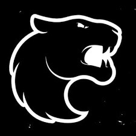
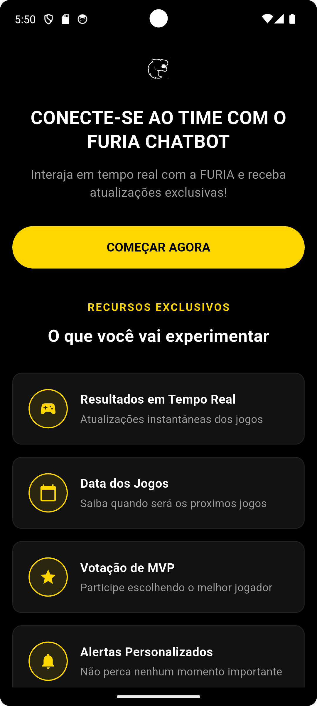
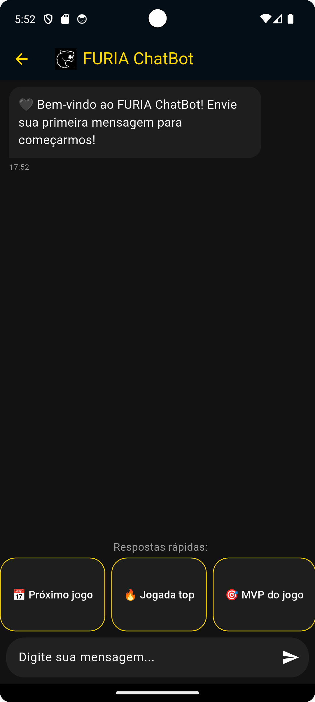

# FURIA ChatBot Challenge 🚀



Um chatbot interativo para fãs da FURIA Esports com atualizações em tempo real e interações exclusivas.

## 📌 Visão Geral

O FURIA ChatBot oferece:

- ✔ Atualizações em tempo real de jogos
- ✔ Informações sobre jogadores
- ✔ Sistema de votação para MVP
- ✔ Respostas rápidas pré-definidas
- ✔ Design com tema oficial da FURIA (preto e amarelo)

## 🗂 Estrutura do Projeto

```plaintext
lib/
├── controllers/        # Controladores da aplicação
│   └── chat_controller.dart  # Lógica principal do chat
├── data/              # Dados e respostas
│   └── bot_responses.dart    # Respostas pré-definidas do bot
├── models/            # Modelos de dados
│   └── message_model.dart    # Modelo de mensagens
├── pages/             # Telas da aplicação
│   ├── chat_page.dart        # Tela principal do chat
│   └── landing_page.dart     # Página inicial
├── widgets/          # Componentes UI
│   └── chat_bubble.dart      # Widget de mensagens
└── main.dart         # Ponto de entrada da aplicação
```
## 🚀 Começando

### Pré-requisitos

- Flutter 3.0+
- Dart 2.17+
- Dispositivo Android/iOS ou emulador

### Instalação

```bash
# Clone o repositório
git clone https://github.com/seu-usuario/furia-chatbot.git

# Acesse a pasta do projeto
cd furia-chatbot

# Instale as dependências
flutter pub get

# Execute o app
flutter run
```

## ✨ Funcionalidades Principais

| Feature          | Descrição                               |
|------------------|-----------------------------------------|
| **Chat Dinâmico** | Mensagens com animações      |
| **Botões Rápidos** | Atalhos para respostas comuns          |
| **Votação MVP**  | Sistema interativo de votação           |
| **Design FURIA** | Tema oficial preto/amarelo              |


## 📸 Screenshots

<div align="center" style="display: flex; justify-content: space-between; flex-wrap: wrap; gap: 10px; margin: 20px 0;">

  <figure style="flex: 1; min-width: 250px;">
    
    <figcaption style="text-align: center; font-size: 0.9em; margin-top: 8px;">Tela Inicial</figcaption>
  </figure>

  <figure style="flex: 1; min-width: 250px;">
    
    <figcaption style="text-align: center; font-size: 0.9em; margin-top: 8px;">Chat Principal</figcaption>
  </figure>

</div>
